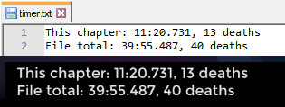

# celeste-timer-text
Put current time and deaths for the file and current/last chapter in a file, for OBS etc. I've only ever tested this with Any%, so if anything breaks, please [create an issue](https://github.com/Kataiser/celeste-timer-text/issues).

## Download and usage
[Celeste_Timer_Text_v1.0.zip](https://github.com/Kataiser/celeste-timer-text/releases/download/v1.0/Celeste_Timer_Text_v1.0.zip) (8.8 MB)  
Run with `run.bat`. Point your recording program at `timer.txt`.
